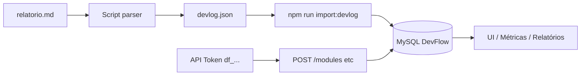

# Plano de importação: `relatorio.md` → DevFlow

**Autor do relatório fonte:** RafaelFett  
**Período fonte:** 07/01/2026 a 14/06/2026  
**Gerado em:** 14/06/2026  
**Documento criado em:** 14/06/2026  

---

## 1. Objetivo

| Item | Descrição |
|------|-----------|
| **Meta** | Registrar no DevFlow projetos, módulos (entregas/dias) e horas com base no `relatorio.md` |
| **Período fonte** | 07/01/2026 a 14/06/2026 |
| **Fonte** | 463 commits em 14 repositórios Git |
| **Destino** | Projetos `ATIVO` (ou status correto), módulos com `workDate` + `hours`, time logs |
| **Não fazer** | Copiar ~1333h estimadas como horas reais — são estimativas por diff de commit |

> O relatório deixa claro: *"Tempo e impacto são estimativas derivadas do tamanho do diff e do texto do commit, não medição real."*

---

## 2. Situação atual (baseline)

### 2.1 No relatório (`relatorio.md`)

| Projeto (relatório) | Commits | Horas est. |
|---------------------|---------|------------|
| Controle de EPI | 118 | ~366h |
| Dashboard de Transporte / Frota | 64 | ~253h |
| Linha de Produção Petkov | 75 | ~249h |
| FiscalMind (IA fiscal) | 61 | ~195h |
| Agenda Sala de Reunião | 55 | ~88h |
| Expedição | 29 | ~57h |
| Sistema de Projetos Interno | 24 | ~53h |
| Site QuietArt | 11 | ~29h |
| Rastreio de Container | 8 | ~14h |
| Sala de Reunião (Monkey-Branch) | 10 | ~14h |
| Anomalias de Transporte | 5 | ~11h |
| Voda App | 2 | ~3h |
| Planilha Dashboard | 1 | ~1,5h |

**Total:** ~1333h estimadas (não são horas reais de trabalho).

### 2.2 No app hoje (projetos ATIVOS — snapshot jun/2026)

| Projeto DevFlow | Horas (time logs) | Situação |
|-----------------|-------------------|----------|
| FiscalMind / Fluxograma de Produto | **124h** | Parcialmente preenchido (18 módulos/dias) |
| Gerenciamento Corumbá | 20h | Fora do relatório Git |
| Gerenciamento de RH | 6h | Fora do relatório; `actualHours` inconsistente |
| QUIET ART | 4,3h | Subestimado vs ~29h no relatório |
| Sistema Interno de Tecnologia | 0,2h | Subestimado vs ~53h no relatório |
| Dashboard Transporte | 0h | Lacuna total vs ~253h |
| Sistema Controle de EPI | 0h | Lacuna total vs ~366h |
| Exportação de Madeira | 0h | Lacuna vs ~57h (Expedição) |
| Sistema Resultado Passado - Edson | 0h | Sem vínculo com relatório |
| `[TEST] Import Devlog` | 1h | **Remover** (artefato de teste) |

**Total registrado hoje:** ~155h reais vs ~1333h estimadas no relatório.

---

## 3. Mapeamento oficial (relatório → DevFlow)

| # | Repositório / relatório | Projeto DevFlow | Ação |
|---|-------------------------|-----------------|------|
| 1 | FiscalMind | FiscalMind / Fluxograma de Produto | **Atualizar** — completar dias faltantes |
| 2 | Sistema de Projetos Interno | Sistema Interno de Tecnologia | **Atualizar** — importar módulos/dias |
| 3 | Controle de EPI | Sistema Controle de EPI | **Atualizar** — zerado hoje |
| 4 | Dashboard de Transporte / Frota | Dashboard Transporte | **Atualizar** — zerado hoje |
| 5 | Expedição | Exportação de Madeira | **Atualizar** — mesmo domínio, nome diferente |
| 6 | Site QuietArt | QUIET ART | **Atualizar** — completar horas |
| 7 | Linha de Produção Petkov | *(novo)* Linha de Produção Petkov | **Criar** |
| 8 | Agenda Sala de Reunião | *(novo)* Agenda Sala de Reunião | **Criar** |
| 9 | Sala de Reunião (Monkey-Branch) | *(novo)* ou unificar com #8 | **Decidir** |
| 10 | Rastreio de Container | *(novo)* Rastreio de Container | **Criar** (se ainda ativo) |
| 11 | Anomalias de Transporte | *(novo)* ou submódulo de Dashboard | **Decidir** |
| 12 | Voda App | *(novo)* Voda App | **Criar** (se ainda ativo) |
| 13 | Planilha Dashboard | *(novo)* Planilha Dashboard | **Criar** (baixa prioridade) |
| — | — | Gerenciamento Corumbá | **Manter** — não vem do Git |
| — | — | Gerenciamento de RH | **Manter** — corrigir inconsistência |
| — | — | Sistema Resultado Passado - Edson | **Manter** — sem import do relatório |
| — | — | `[TEST] Import Devlog` | **Excluir** |

---

## 4. Regras de conversão (relatório → módulo + horas)

### 4.1 Unidade de registro

```
1 dia com commits no relatório
  → 1 módulo no DevFlow
  → name: resumo curto (primeiro commit ou tema do dia)
  → workDate: data do bloco "### sexta-feira, 12/06/2026"
  → hours: regra abaixo
  → status: derivado do progresso
```

### 4.2 Cálculo de horas (proposta conservadora)

| Tempo no relatório | Horas a importar |
|--------------------|------------------|
| 5–15 min | 0,25h |
| 15–30 min | 0,5h |
| 30–60 min | 1h |
| 1–2 h | 1,5h |
| 2–4 h | 3h |
| 4–6 h | 5h |
| 6–8 h+ | 6h |
| **Teto por dia** | **8h** (mesmo com vários commits) |
| Commits só de lockfile / 1 linha | 0,25h ou ignorar |

**Desconto opcional global:** 70% das horas estimadas do resumo executivo (evita inflar EPI/Dashboard).

### 4.3 Status do módulo

| Condição | Status | Progresso |
|----------|--------|-----------|
| Dia antigo, entrega concluída | `CONCLUIDO` | 100% |
| Dia recente / WIP | `EM_PROCESSO` | 50% |
| Primeiro registro do projeto | `INICIADO` | 0% |

### 4.4 Progresso do projeto

```
progresso = média do progresso dos módulos
actualHours = soma dos time logs (automático na importação)
```

---

## 5. Arquitetura técnica



### Ferramentas já existentes no projeto

| Ferramenta | Uso |
|------------|-----|
| `devlog.json` | Manifesto de importação (projetos + módulos + horas) |
| `npm run import:devlog` | Sincroniza com banco (idempotente por nome) |
| `POST /api/devlog/sync` | Import via arquivo no servidor |
| `POST /api/devlog/import` | Import via body JSON |
| API token `df_...` | Automação futura (CI, cron) — gerado em `/profile` → aba API |

### O que falta implementar

| # | Entrega | Descrição |
|---|---------|-----------|
| 1 | `scripts/relatorio-to-devlog.mjs` | Lê `relatorio.md` → gera `devlog.json` |
| 2 | `import-mapping.json` | Mapeamento nome relatório → nome DevFlow |
| 3 | `import-rules.json` | Tetos, descontos, commits a ignorar |
| 4 | Modo `--dry-run` | Preview: projetos, módulos, horas, sem gravar |
| 5 | Relatório de diff | `import-preview.md`: o que será criado/atualizado |

---

## 6. Fases de execução

### Fase 0 — Preparação (1 dia)

- [ ] Backup do banco (`mysqldump devflow_db`)
- [ ] Definir `ownerEmail` no `devlog.json` (usuário admin responsável)
- [ ] Remover projeto `[TEST] Import Devlog`
- [ ] Remover módulos seed genéricos ("Entrega Principal", "Qualidade e Homologação") onde não fizer sentido
- [ ] Revisar status:
  - EPI: `endDate` 01/06 passou → `CONCLUIDO` ou estender prazo?
  - QuietArt: `endDate` = `startDate` → ajustar

### Fase 1 — Parser do relatório (1–2 dias)

- [ ] Parser de blocos `### dia` e `#### projeto`
- [ ] Extrair: data, repo, commits, estimativa de tempo, descrição
- [ ] Agrupar por `(projeto DevFlow, data)` → somar horas com teto 8h/dia
- [ ] Aplicar mapeamento de nomes
- [ ] Gerar `devlog.json` + `import-preview.md`
- [ ] **Revisão manual** do preview antes de importar

### Fase 2 — Piloto (meio dia)

Importar só **1 projeto** para validar:

| Ordem | Projeto | Motivo |
|-------|---------|--------|
| 1º | Sistema Interno de Tecnologia | Repo atual; fácil validar |
| 2º | QUIET ART | Pequeno (~29h) |
| 3º | FiscalMind | Completar gap 124h → ~195h |

Checklist pós-piloto:

- [ ] Horas batem com expectativa
- [ ] Métricas em `/metrics` e `/reports` corretas
- [ ] Reimport não duplica módulos (idempotência por nome)

### Fase 3 — Import em lote (2–3 dias)

Ordem sugerida por impacto:

| Prioridade | Projeto | Horas est. (relatório) | Horas alvo import |
|------------|---------|------------------------|-------------------|
| P1 | Sistema Controle de EPI | 366h | ~120–180h (com teto/desconto) |
| P1 | Dashboard Transporte | 253h | ~80–120h |
| P2 | Linha de Produção Petkov | 249h | criar + ~80–120h |
| P2 | FiscalMind (completar) | +71h gap | ~71h |
| P3 | Agenda Sala de Reunião | 88h | ~40–60h |
| P3 | Expedição → Exportação Madeira | 57h | ~25–40h |
| P3 | Sistema Interno de Tecnologia | 53h | ~25–35h |
| P4 | Demais (Rastreio, QuietArt restante, etc.) | ~40h | conforme atividade |

**Estratégia:** importar **mês a mês** (jan → jun) para revisar aos poucos.

### Fase 4 — Correções pós-import (1 dia)

- [ ] Ajustar status FiscalMind (módulos antigos `INICIADO` → `CONCLUIDO`)
- [ ] Recalcular `progress` de todos os projetos importados
- [ ] Corrigir Gerenciamento RH (`actualHours` vs time logs)
- [ ] Projetos inativos → `PAUSADO` ou `CONCLUIDO`

### Fase 5 — Automação contínua (opcional)

- [ ] Script que gera relatório Git semanal → `devlog.json`
- [ ] Cron no servidor: `POST /api/devlog/sync` ou `npm run import:devlog`
- [ ] Token API pessoal documentado no perfil

---

## 7. Formato alvo (`devlog.json`)

Exemplo para um dia do relatório:

```json
{
  "ownerEmail": "seu@email.com",
  "projects": [
    {
      "name": "Sistema Interno de Tecnologia",
      "status": "ATIVO",
      "modules": [
        {
          "name": "Docker, demand attachments e refactor frontend",
          "description": "9 commits em 12/06/2026 — sistema-de-projetos-interno",
          "status": "CONCLUIDO",
          "workDate": "2026-06-12",
          "hours": 6
        }
      ]
    }
  ]
}
```

### Comportamento do importador

- **Idempotência:** reimportar o mesmo módulo (mesmo projeto + mesmo `name`) **atualiza** status/descrição.
- **Horas:** time log é criado **apenas na criação** do módulo (reimport não duplica horas se o módulo já existir).
- **Progresso:** recalculado como média do progresso dos módulos.

### Comando de importação

```bash
# Na raiz do repositório
npm run import:devlog

# Ou com caminho customizado
DEVLOG_PATH=./devlog.json npm run import:devlog --prefix backend
```

---

## 8. Riscos e mitigações

| Risco | Impacto | Mitigação |
|-------|---------|-----------|
| Horas infladas no relatório | Métricas irreais | Teto 8h/dia + desconto 70% |
| Duplicar módulos com nomes diferentes | Horas dobradas | Nomenclatura padrão: `YYYY-MM-DD — tema` |
| Commits massivos (lockfile 22k linhas) | 6–8h falsos | Lista de ignore patterns |
| Projetos duplicados (2 salas de reunião) | Confusão | Unificar ou renomear antes |
| Import parcial FiscalMind | Gap 124 vs 195h | Import só dias ausentes (diff por `workDate`) |
| Encoding (Expedição, Produção) | Nomes errados | Normalizar UTF-8 no parser |

---

## 9. Critérios de sucesso

| Critério | Meta |
|----------|------|
| Projetos ativos mapeados | 100% dos que você mantém em produção |
| Horas registradas | Entre **200–400h** total importado (realista para 6 meses) |
| Lacunas zeradas | EPI, Dashboard, DevFlow com módulos por dia |
| UI | `/metrics`, `/reports/hours`, detalhe do projeto coerentes |
| Reimport | Rodar 2x sem duplicar dados |
| Rastreabilidade | Cada módulo com `workDate` + descrição ligada ao commit |

---

## 10. Decisões pendentes

Antes de executar, confirmar:

1. **Quais dos 7 projetos ausentes criar?** (Petkov, Agenda, Rastreio, Voda, Planilha, Anomalias, Sala Monkey-Branch)
2. **Unificar** Agenda + Sala Monkey-Branch **em um projeto só**?
3. **Período:** jan–jun inteiro ou só **mar–jun**?
4. **Regra de horas:** teto 8h/dia **ou** desconto 70% **ou** ambos?
5. **EPI:** continua `ATIVO` ou marcar `CONCLUIDO` (endDate passou)?
6. **Remover** `[TEST] Import Devlog` e módulos seed genéricos?

---

## 11. Cronograma sugerido

| Semana | Atividade |
|--------|-----------|
| **Sem 1** | Fase 0 + parser + preview + piloto (DevFlow + QuietArt) |
| **Sem 2** | FiscalMind + Dashboard + EPI (jan–mar) |
| **Sem 3** | EPI + Dashboard (abr–jun) + Petkov + Expedição |
| **Sem 4** | Projetos menores + correções + automação |

**Esforço estimado:** 4–6 dias de desenvolvimento + 2–3h de revisão manual do preview.

---

## 12. Próximo passo concreto

1. Confirmar decisões da seção 10 *(defaults já aplicados na implementação)*
2. Gerar preview: `npm run relatorio:preview`
3. Importar: `npm run relatorio:import`
4. Validar na UI e ajustar

---

## 13. Implementação (concluída)

### Arquivos

| Arquivo | Função |
|---------|--------|
| `scripts/relatorio-to-devlog.mjs` | Parser `relatorio.md` → `devlog.json` |
| `scripts/import-devlog-batch.mjs` | Import por projeto (estável em DB remoto) |
| `import-mapping.json` | Mapeamento relatório → DevFlow |
| `import-rules.json` | Tetos, período, filtros |
| `devlog.json` | Manifesto gerado (não versionar se preferir) |
| `import-preview.md` | Preview da importação |

### Comandos

```bash
npm run relatorio:preview    # dry-run → import-preview.md
npm run relatorio:build        # gera devlog.json
npm run relatorio:import       # build + import por projeto
npm run import:devlog          # import direto do devlog.json
```

### Comportamento do importador

- Módulos identificados por **nome** ou **workDate** (evita duplicar FiscalMind)
- Dias já registrados com horas são **ignorados**
- `cleanupProjects` remove `[TEST] Import Devlog` na primeira execução
- Retry automático em transações (DB remoto)

---

## Referências

- Fonte: [`relatorio.md`](../relatorio.md)
- Exemplo de manifesto: [`devlog.example.json`](../devlog.example.json)
- Importador: `backend/src/devlog/import-devlog.runner.ts`
- Comando: `npm run import:devlog`
